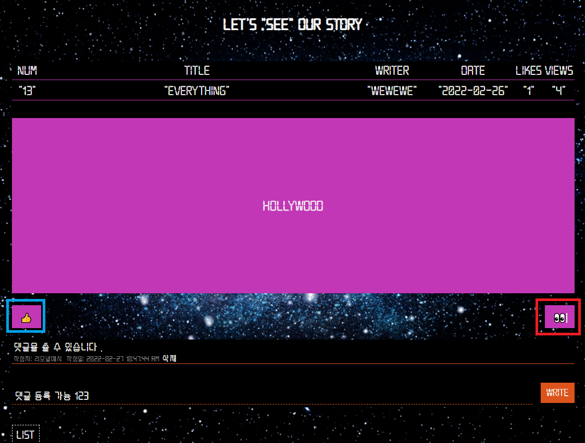
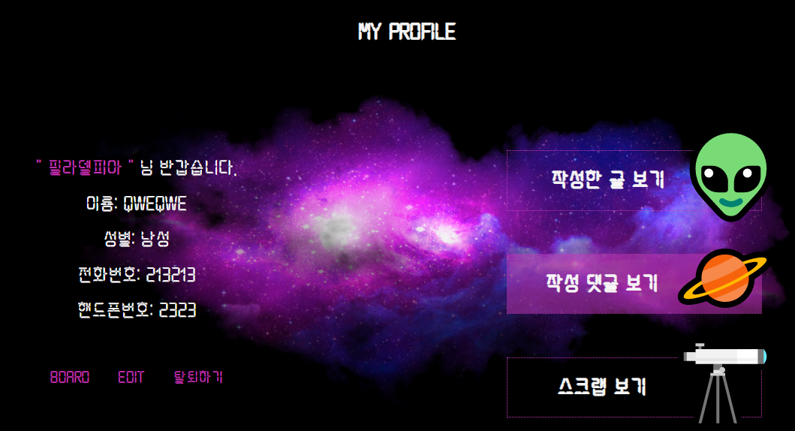

# Space concept web page[게시판 기능을 포함한 우주웹페이지]
## Description[설명]

A web page that provides functions such as member registration, login,logout, withdrawl, profile edit, bulletin board (including writing, comments, likes, scrap, and number of views), super administrator(Change of membership level and suspension of use)

우주 컨셉을 기반으로 한  회원가입, 로그인, 로그아웃, 회원탈퇴, 프로필 수정 ,게시판(글쓰기, 댓글, 좋아요 ,스크랩 ,조회수)
최고 관리자(회원 등급 변경과 이용 중지) 기능을 포함한 웹페이지

# Enviorment[작업 환경]
 

macOS 와 Windows10 운영체제에서 git을 통한 공동작업
__________
## 환경 설정
- ### windows terminal 

- ### 해당프로젝트 로 이동 후 Visual Studio Code 열기

- ### DB연동을 위한 Mysql 설정

Mysql 설치시 설정했던 아이디와 비밀번호를 빈칸에 작성하여 로그인

**후술에 작성 될 .env문서에 필요**
___

# Browser support [브라우저 환경]
 - Chrome 과 IE
 

 각 최신버전 98에서 구동 확인
 ___

# How to use[사용법]  

- ### npm install 과 .env 설정

**.env파일을 추가**

.env에서 본인의 DB_ID와 DB_PW를 설정

- Terminal 

Visual Studio Code 내 terminal에서 *node server* 입력
 

 ### Internet url : localhost:3000 로 접속

# 목차
## 1. Main Page

## 2. Join/login   
  
     

- ID,PW,NAME,NICKNAME,GENDER,NUMBER,PHONENUMBER을 입력
- ID는 중복확인기능이 포함 
  
___
## 3. Board 

 
 
 - 글 작성
 - 회원가입한 회원만 이용 가능

 - 댓글 작성 ,조회수 ,좋아요(왼쪽 하단) , 삭제 , 스크랩 기능(오른쪽 하단)  포함

  
## 4. PROFILE

  
 
-  프로필 수정,회원탈퇴 기능 포함 
-  작성글 , 작성댓글 , 스크랩 열람 기능

## 5. ADMIN
 
 
 -  localhost:3000/admin 으로 접속
 -  회원정보수정 권한

___
## 역할 분담
팀명 : SPACE-OJ3
팀장 : 오하은
팀원 : 장재원, 장주찬, 지정환

### 오하은(프론트엔드) - haeun9627@hanmail.net
- 전체 일정 조율, 
- 전체 웹페이지 디자인 구상
- 모든 페이지 html, css 총괄,
- nunjucks 활용해서 html, css 작업
- 오류 및 점검사항 체크
### 장재원(백엔드) - bitkunst23@gmail.com
- 커넥션 풀과 프로미스를 활용해서 데이터베이스와 연결 및 작업 진행
- 데이터베이스 테이블 스키마 제작
- 게시판 페이지 CRUD 작업,
- 미들웨어 활용해서 게시판 및 관리자 페이지 접근권한 체크 기능 제작
- 좋아요, 댓글, 스크랩, 조회수 기능 작업
- 관리자 페이지 CRUD 작업,
- 회원등급변경, 회원이용권한 기능 작업
- 프로필 페이지에서 작성글보기, 작성댓글보기, 스크랩보기 기능 작업
- 프론트엔드 서포트 (메인페이지 애니메이션 작업 , html5 canvas 활용)

### 장주찬(백엔드) - jucham96@gmail.com
- 커넥션 풀과 프로미스를 활용해서 데이터베이스와 연결 및 작업 진행
- 사용자 로그인 기능 작업, 
- 사용자 회원가입 기능 작업,
- 프론트엔드 서포트 (마우스 커서 디자인 및 백그라운드 이미지 작업) 

### 지정환(백엔드) - cjh5701@hanmail.net
- 커넥션 풀과 프로미스를 활용해서 데이터베이스와 연결 및 작업 진행
- 사용자 프로필 정보 수정 작업
- 사용자 회원 탈퇴 기능 작업
- readme 파일 제작
- 프론트엔드 서포트 (프로필 페이지 애니메이션 효과, 전체 페이지 폰트 작업)

팀장의 한마디 : 일주일동안 새벽까지 작업하시느라 고생 많으셨습니다.

### 최신 버전  update 2022-02-27
