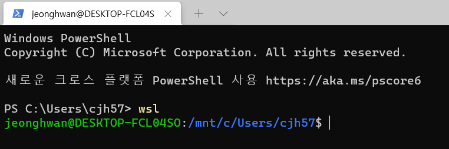
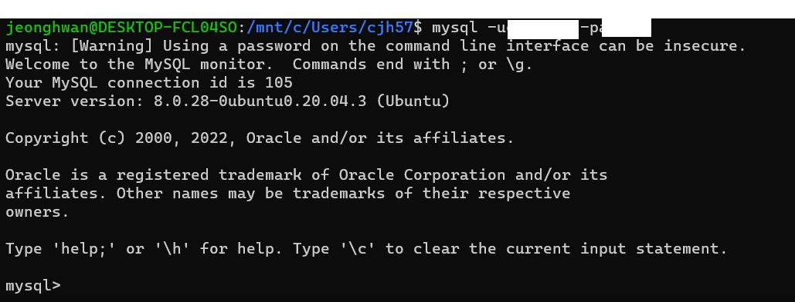
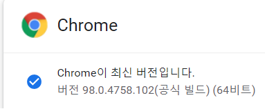
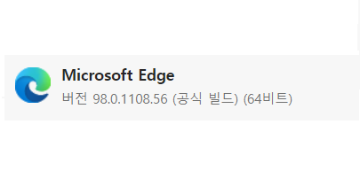
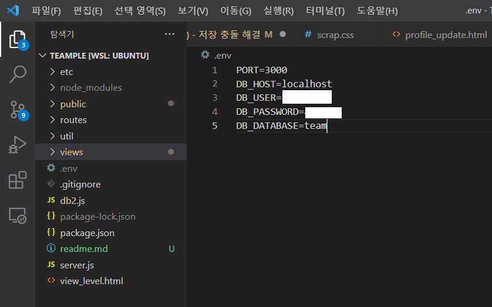
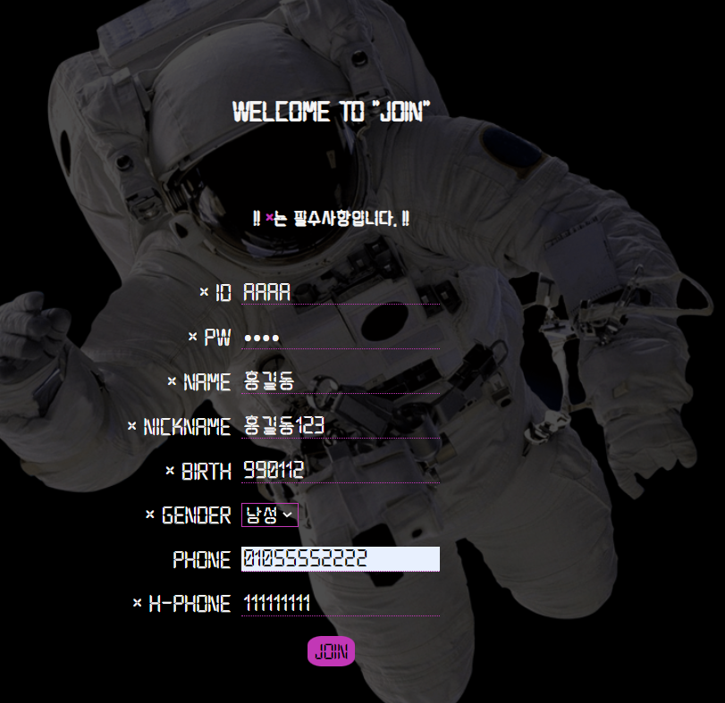
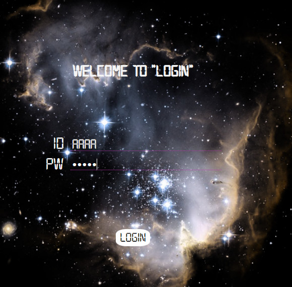
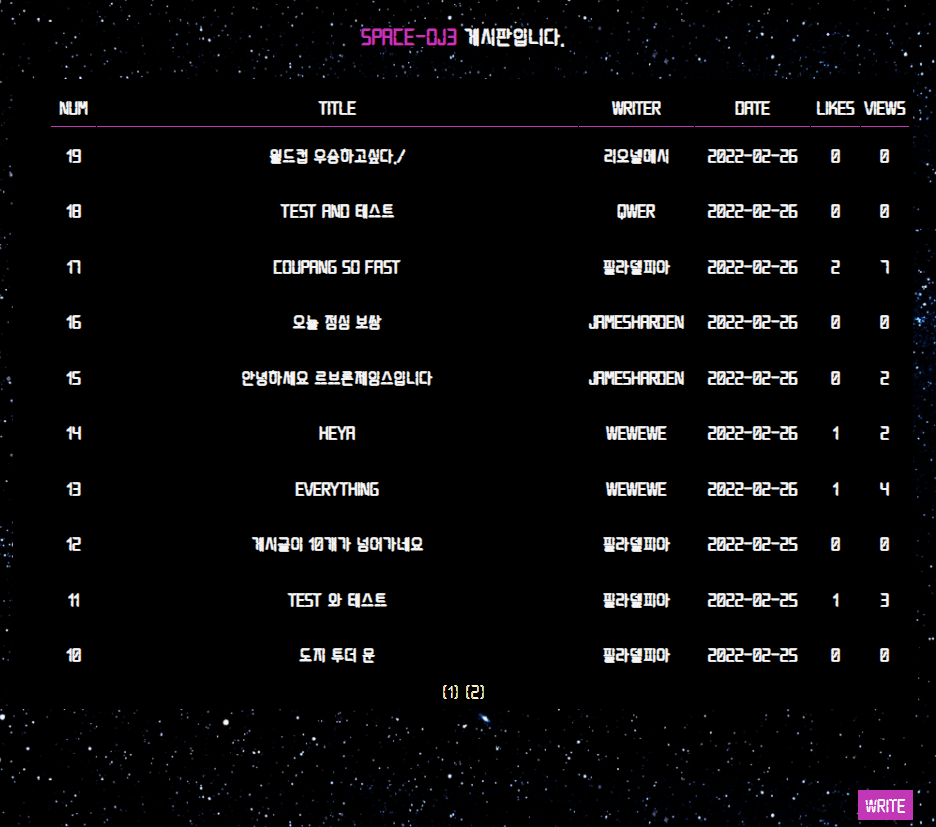
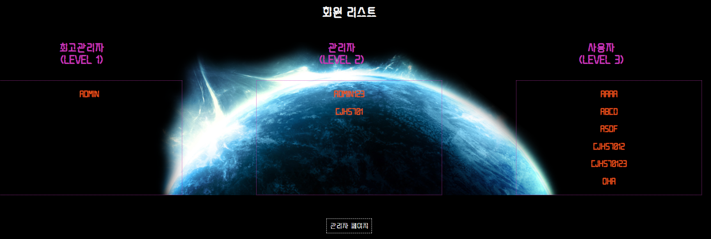

# Space concept web page[게시판 기능을 포함한 우주웹페이지]
## Description[설명]

A web page that provides functions such as member registration, login,logout bulletin board (including writing, comments, likes, scrap, and number of views), super administrator, etc.
우주 컨셉을 기반으로 한  회원가입, 로그인, 로그아웃, 게시판(글쓰기, 댓글, 좋아요 ,스크랩 ,조회수), 최고 관리자 기능을 포함한 웹페이지

# Enviorment[작업 환경]
 

macOS 와 Windows10 운영체제에서 git을 통한 공동작업
__________
## 환경 설정
- ### windows terminal 

- ### 해당프로젝트 로 이동 후 Visual Studio Code 열기

- ### DB연동을 위한 Mysql 설정

Mysql 설치시 설정했던 아이디와 비밀번호를 빈칸에 작성하여 로그인

**후술에 작성 될 .env문서에 필요**
___

# Browser support [브라우저 환경]
 - Chrome 과 IE
 

 각 최신버전 98에서 구동 확인
 ___

# How to use[사용법]  

- ### npm install 과 .env 설정

**.env파일을 추가**

.env에서 본인의 DB_ID와 DB_PW를 설정

- Terminal 

Visual Studio Code 내 terminal에서 *node server* 입력
 

 ### Internet url : localhost:3000 로 접속

# 목차
## 1. Main Page

## 2. Join/login   
  
     

- ID,PW,NAME,NICKNAME,GENDER,NUMBER,PHONENUMBER을 입력
- ID는 중복확인기능이 포함 
  
___
## 3. Board 

 
 
 - 글 작성, 댓글 작성 ,조회수 ,좋아요 , 삭제 기능 포함
 - 회원가입한 회원만 이용 가능
  
## 4. ADMIN
 
 
 -  localhost:3000/admin 으로 접속
 -  회원정보수정 권한

___
  

## 코드 설명?

## 역할 분담

### 배포시 문의?
### 최신 버전  update 2022-02-26
